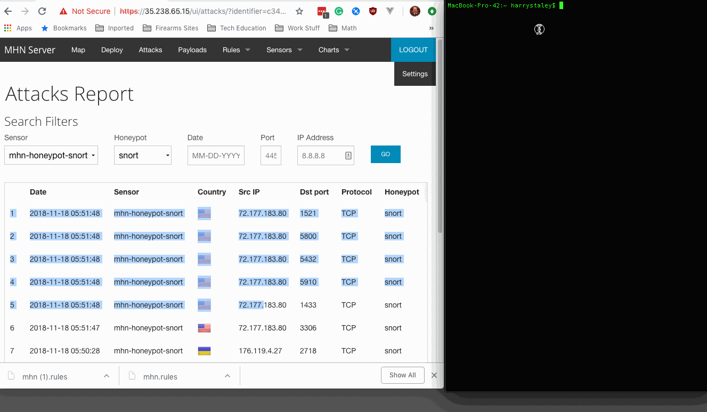
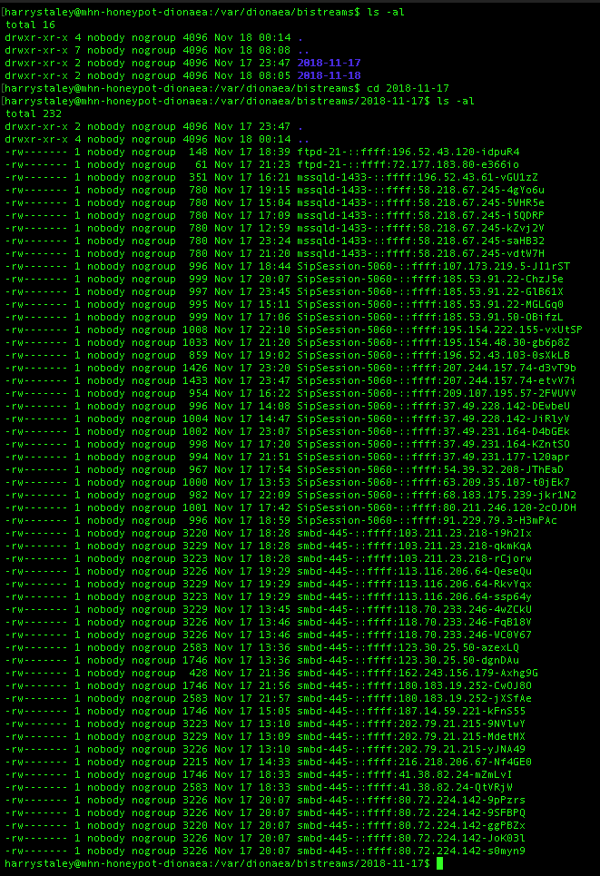
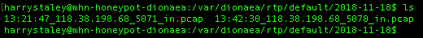
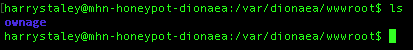

# CSCI4349 Week 9: Honeypot

## MANUAL HONEYPOT SETUP

git clone this repo
```
git clone https://github.com/harrystaley/CSCI4349_Week9_Honeypot
```
open your terminal application and execute the following command
```
vagrant up
vagrant ssh
```
wich should bring you to a new terminal prompt on your newly created linux box
```
cd /vagrant
```
initialize google cloud
```
gcloud init
```
login and instert the name of your new project.

Setting defualt region and zone
```
gcloud config set compute/zone us-central1-c
gcloud config set compute/region us-central1
```
First, create a firewall rule to allow ingress traffic on TCP ports 3000, 10000, 80, and 443. The following command can be used to do this via the command line:
```
gcloud beta compute firewall-rules create mhn-allow-admin --direction=INGRESS --priority=1000 --network=default --action=ALLOW --rules=tcp:3000,tcp:10000,tcp:80,tcp:443 --source-ranges=0.0.0.0/0 --target-tags=mhn-admin
```
create the VM instance mhn-admin
```
gcloud compute instances create "mhn-admin" --machine-type "f1-micro" --subnet "default" --maintenance-policy "MIGRATE"  --scopes "https://www.googleapis.com/auth/devstorage.read_only","https://www.googleapis.com/auth/logging.write","https://www.googleapis.com/auth/monitoring.write","https://www.googleapis.com/auth/servicecontrol","https://www.googleapis.com/auth/service.management.readonly","https://www.googleapis.com/auth/trace.append" --tags "mhn-admin","http-server","https-server" --image $IMAGE --image-project "ubuntu-os-cloud" --boot-disk-size "10" --boot-disk-type "pd-standard" --boot-disk-device-name "mhn-admin"
```
you should now see a new instance created writing down the <strong>external ip address<strong>.
```
NAME              ZONE           MACHINE_TYPE  PREEMPTIBLE  INTERNAL_IP  EXTERNAL_IP    STATUS
mhn-admin         us-central1-c  f1-micro                   10.128.0.11  35.192.133.42  RUNNING
```
now ssh into the instance we just created
```
gcloud compute ssh mhn-admin 
```
update packages and install git
```
sudo apt-get update
sudo apt-get install git -y
```
navigated to ```/opt/mhn/scrpts``` and modified by running ```sudo vim install_hpfeeds.sh```
```
cd /opt/mhn/scripts
```
if they exist change either ```sudo git clone https://github.com/RedolentSun/pyev.git#egg=pyev```  or ```sudo git clone https://github.com/HurricaneLabs/pyev.git#egg=pyev```
to ```sudo git clone https://github.com/couozu/pyev.git#egg=pyev```

navigate back over to ```/opt``` and clone the required repo
```
cd /opt
sudo git clone https://github.com/RedolentSun/mhn.git
cd mhn
sudo ./install.sh
```
you will then be prompted several time
```Do you wish to run in Debug mode? y/n : ```n
```Superuser email:``` You can use any email -- this will be your username to login to the admin console.
```Superuser password:``` Choose any password -- you'll be asked to confirm.
the script will run more and you can then accept the defaults or n for each prompt.
```
Server base url ["http://#.#.#.#"]:
Honeymap url ["http://#.#.#.#:3000"]:
Mail server address ["localhost"]:
Mail server port [25]:
Use TLS for email?: y/n n
Use SSL for email?: y/n n
Mail server username [""]:
Mail server password [""]:
Mail default sender [""]:
Path for log file ["/var/log/mhn/mhn.log"]:
```
you will then be prompted again inc which case you will answer n.
```
Would you like to integrate with Splunk? (y/n) n
Would you like to install ELK? (y/n) n
```
Now lets double check that all of our services are up and running.
```
sudo /etc/init.d/nginx status
sudo /etc/init.d/supervisor status
sudo supervisorctl status
```
once all three commands are finished you should see the below statuses.
```
user@precise64:/opt/mhn/scripts$ sudo /etc/init.d/nginx status
 * nginx is running
user@precise64:/opt/mhn/scripts$ sudo /etc/init.d/supervisor status
 is running
user@precise64:/opt/mhn/scripts$ sudo supervisorctl status
geoloc                           RUNNING    pid 31443, uptime 0:00:12
honeymap                         RUNNING    pid 30826, uptime 0:08:54
hpfeeds-broker                   RUNNING    pid 10089, uptime 0:36:42
mhn-celery-beat                  RUNNING    pid 29909, uptime 0:18:41
mhn-celery-worker                RUNNING    pid 29910, uptime 0:18:41
mhn-collector                    RUNNING    pid 7872,  uptime 0:18:41
mhn-uwsgi                        RUNNING    pid 29911, uptime 0:18:41
mnemosyne                        RUNNING    pid 28173, uptime 0:30:08
```
we are all set to start installing our honeypots.

now we have a choice you can either create the honeypots manually or use a handy script that I have created that will give you the most popular honeypots.

### complete Manual Setup
we will next set our firewall rules for our honeypots.
```
gcloud beta compute firewall-rules create mhn-allow-honeypot --direction=INGRESS --priority=1000 --network=default --action=ALLOW --rules=all --source-ranges=0.0.0.0/0 --target-tags=mhn-honeypot
```
next it is time to create our honeypots substituting mhn-honeypot-1 for whatever we want to name htis honeypot.
```
$ gcloud compute instances create "mhn-honeypot-1" --machine-type "f1-micro" --subnet "default" --maintenance-policy "MIGRATE"  --scopes "https://www.googleapis.com/auth/devstorage.read_only","https://www.googleapis.com/auth/logging.write","https://www.googleapis.com/auth/monitoring.write","https://www.googleapis.com/auth/servicecontrol","https://www.googleapis.com/auth/service.management.readonly","https://www.googleapis.com/auth/trace.append" --tags "mhn-honeypot","http-server" --image "ubuntu-1404-trusty-v20171010" --image-project "ubuntu-os-cloud" --boot-disk-size "10" --boot-disk-type "pd-standard" --boot-disk-device-name "mhn-honeypot-1"
```
ssh into the honeypot
```
gcloud compute ssh mhn-honeypot-1
```

#### Final Steps
Login to your MHN server web app.
Click the "Deploy" link in the upper left hand corner.
Select a type of honeypot from the drop down menu (e.g. "Ubuntu Dionaea").
Copy the deployment command.
Go back to your terminal and run this command as root
```
sudo <honeypot command>
```
You can continue to create as many honeypots as you like by following simply skipping the first step in this section.

### Script Setup
navigate to ```/vagrant/scripts```
run the following command substituting in the ip address of your admin server and the image used in your previous install.
Since our example image was ```ubuntu-1404-trusty-v20181114``` and our mhn admin server ip address is ```35.238.65.15```
and the command for our honeypot install script is below.
```
sudo ./gcloud_honeypot_setup.sh <image> <mhn-admin-ip>
```
we are going to run:
```
sudo ./gcloud_honeypot_setup.sh ubuntu-1404-trusty-v20181114 35.238.65.15
```

You should now see lots of honeypots in your mhn-admin sensors panel.

## HONEYPOT SETUP WITH COMPLETE AUTOMATION

I have created two setup scripts [gcloud_honeypot_setup.sh](./scripts/gcloud_honeypot_setup.sh) and [gcloud_mhn-admin_setup.sh](./scripts/gcloud_mhn-admin_setup.sh).

git clone this repo
```
git clone https://github.com/harrystaley/CSCI4349_Week9_Honeypot
```
open your terminal application and execute the following command
```
vagrant up
vagrant ssh
```
wich should bring you to a new terminal prompt on your newly created linux box
```
cd /vagrant
```

run ```gcloud init``` and follow the prompts to set up your project for more information consult the [google cloud documentation](https://cloud.google.com/sdk/docs/).

our zone is ```us-central1-c```, our region is ```us-central1```, and our image is ```ubuntu-1404-trusty-v20181114 ```.

The command for our honeypot install script is below.
```
sudo ./gcloud_mhn-admin_setup.sh <zone> <region> <image>
```
thus run
```
sudo ./gcloud_mhn-admin_setup.sh us-central1-c us-central1 ubuntu-1404-trusty-v20181114
```
our image is ```ubuntu-1404-trusty-v20181114``` and our mhn admin server ip address is ```35.238.65.15```

The command for our honeypot install script is below.
```
sudo ./gcloud_honeypot_setup.sh <image> <mhn-admin-ip>
```
thus run
```
sudo ./gcloud_honeypot_setup.sh ubuntu-1404-trusty-v20181114 35.238.65.15
```

## Honeypots Deployed

HONEYPOT | NAME | ZONE | MACHINE_TYPE 	| PREEMPTIBLE | INTERNAL_IP | EXTERNAL_IP | DOCUMENTATION
-----|-----|------|--------------	|-------------|-------------|-------------|---------
N/A 			| mhn-admin  					| us-central1-c | f1-micro  |             | 10.128.0.2  | 35.238.65.15   | [MHN Wiki](https://github.com/threatstream/mhn/wiki)
dionea 			| mhn-honeypot-dionaea  		| us-central1-c | f1-micro  |             | 10.128.0.3  | 35.202.115.178 | [Dionea Docs](https://dionaea.readthedocs.io/en/latest/index.html)
wordpot 		| mhn-honeypot-wordpot  		| us-central1-c | f1-micro  |             | 10.128.0.4  | 35.238.4.126   | [Wordpot Docs](https://github.com/gbrindisi/wordpot)
shockpot 		| mhn-honeypot-shockpot  		| us-central1-c | f1-micro  |             | 10.128.0.5  | 35.202.178.69  | [Shockpot Docs](https://github.com/threatstream/shockpot)
dionea w. http 	| mhn-honeypot-diondeahttp  	| us-central1-c | f1-micro  |             | 10.128.0.6  | 35.224.95.32   | [Dionea Docs](https://dionaea.readthedocs.io/en/latest/index.html)
snort 			| mhn-honeypot-snort  			| us-central1-c | f1-micro  |             | 10.128.0.7  | 104.197.157.56 | [Snort Docs](http://manual-snort-org.s3-website-us-east-1.amazonaws.com/)
kippo as juniper| mhn-honeypot-kippojuniper  	| us-central1-c | f1-micro  |             | 10.128.0.8  | 35.239.238.94  | [Kippo Juniper Docs](https://github.com/gregcmartin/Kippo_JunOS)
surcata			| mhn-honeypot-suricata  		| us-central1-c | f1-micro  |             | 10.128.0.9  | 35.192.85.103  | [suricata](https://suricata-ids.org/docs/)

### setting up wordpot

```
cd /opt/wordpot
sudo pip install flask
sudo pip install hpfeeds
sudo python wordpot.py
```

### setting up snort
The basic install from mhn get you some functionality to play with out of the box

## Attacks Executed

### snort



### dionea



Looking at ```/var/dionaea``` I notice that files are located there even a file that I placed in wwwroot. I also can see files that were placed in the folders by attackers, but never registered as payloads in mhn admin.






### wordpot

```
wpscan -u http://35.238.4.126/
```
```
[+] URL: http://35.238.4.126/
[+] Started: Sun Nov 18 15:50:40 2018

[+] Interesting header: SERVER: Apache/2.2.22 (Ubuntu)
[+] XML-RPC Interface available under: http://35.238.4.126/xmlrpc.php   [HTTP 200]
[+] Found an RSS Feed: #   [HTTP 0]

[+] Enumerating WordPress version ...
[!] The WordPress 'http://35.238.4.126/readme.html' file exists exposing a version number

[+] WordPress version 2.8 (Released on 2009-06-11) identified from meta generator, readme
[!] 27 vulnerabilities identified from the version number

[!] Title: WordPress 2.5 - 3.3.1 XSS in swfupload
    Reference: https://wpvulndb.com/vulnerabilities/5999
    Reference: http://seclists.org/fulldisclosure/2012/Nov/51
[i] Fixed in: 3.3.2

[!] Title: WordPress 1.5.1 - 3.5 XMLRPC Pingback API Internal/External Port Scanning
    Reference: https://wpvulndb.com/vulnerabilities/5988
    Reference: https://github.com/FireFart/WordpressPingbackPortScanner
    Reference: https://cve.mitre.org/cgi-bin/cvename.cgi?name=CVE-2013-0235
[i] Fixed in: 3.5.1

[!] Title: WordPress 1.5.1 - 3.5 XMLRPC pingback additional issues
    Reference: https://wpvulndb.com/vulnerabilities/5989
    Reference: http://lab.onsec.ru/2013/01/wordpress-xmlrpc-pingback-additional.html

[!] Title: WordPress 2.0 - 3.0.1 wp-includes/comment.php Bypass Spam Restrictions
    Reference: https://wpvulndb.com/vulnerabilities/6009
    Reference: https://cve.mitre.org/cgi-bin/cvename.cgi?name=CVE-2010-5293
[i] Fixed in: 3.0.2

[!] Title: WordPress 2.0 - 3.0.1 Multiple Cross-Site Scripting (XSS) in request_filesystem_credentials()
    Reference: https://wpvulndb.com/vulnerabilities/6010
    Reference: https://cve.mitre.org/cgi-bin/cvename.cgi?name=CVE-2010-5294
[i] Fixed in: 3.0.2

[!] Title: WordPress 2.0 - 3.0.1 Cross-Site Scripting (XSS) in wp-admin/plugins.php
    Reference: https://wpvulndb.com/vulnerabilities/6011
    Reference: https://cve.mitre.org/cgi-bin/cvename.cgi?name=CVE-2010-5295
[i] Fixed in: 3.0.2

[!] Title: WordPress 2.0 - 3.0.1 wp-includes/capabilities.php Remote Authenticated Administrator Delete Action Bypass
    Reference: https://wpvulndb.com/vulnerabilities/6012
    Reference: https://cve.mitre.org/cgi-bin/cvename.cgi?name=CVE-2010-5296
[i] Fixed in: 3.0.2

[!] Title: WordPress 2.0 - 3.0 Remote Authenticated Administrator Add Action Bypass
    Reference: https://wpvulndb.com/vulnerabilities/6013
    Reference: https://cve.mitre.org/cgi-bin/cvename.cgi?name=CVE-2010-5297
[i] Fixed in: 3.0

[!] Title: WordPress 2.0.3 - 3.9.1 (except 3.7.4 / 3.8.4) CSRF Token Brute Forcing
    Reference: https://wpvulndb.com/vulnerabilities/7528
    Reference: https://core.trac.wordpress.org/changeset/29384
    Reference: https://core.trac.wordpress.org/changeset/29408
    Reference: https://cve.mitre.org/cgi-bin/cvename.cgi?name=CVE-2014-5204
    Reference: https://cve.mitre.org/cgi-bin/cvename.cgi?name=CVE-2014-5205
[i] Fixed in: 3.9.2

[!] Title: WordPress <= 4.0 - Long Password Denial of Service (DoS)
    Reference: https://wpvulndb.com/vulnerabilities/7681
    Reference: http://www.behindthefirewalls.com/2014/11/wordpress-denial-of-service-responsible-disclosure.html
    Reference: https://wordpress.org/news/2014/11/wordpress-4-0-1/
    Reference: https://cve.mitre.org/cgi-bin/cvename.cgi?name=CVE-2014-9034
    Reference: https://www.rapid7.com/db/modules/auxiliary/dos/http/wordpress_long_password_dos
    Reference: https://www.exploit-db.com/exploits/35413/
    Reference: https://www.exploit-db.com/exploits/35414/
[i] Fixed in: 4.0.1

[!] Title: WordPress <= 4.0 - Server Side Request Forgery (SSRF)
    Reference: https://wpvulndb.com/vulnerabilities/7696
    Reference: http://www.securityfocus.com/bid/71234/
    Reference: https://core.trac.wordpress.org/changeset/30444
    Reference: https://cve.mitre.org/cgi-bin/cvename.cgi?name=CVE-2014-9038
[i] Fixed in: 4.0.1

[!] Title: WordPress <= 4.4.2 - SSRF Bypass using Octal & Hexedecimal IP addresses
    Reference: https://wpvulndb.com/vulnerabilities/8473
    Reference: https://codex.wordpress.org/Version_4.5
    Reference: https://github.com/WordPress/WordPress/commit/af9f0520875eda686fd13a427fd3914d7aded049
    Reference: https://cve.mitre.org/cgi-bin/cvename.cgi?name=CVE-2016-4029
[i] Fixed in: 4.5

[!] Title: WordPress 2.6.0-4.5.2 - Unauthorized Category Removal from Post
    Reference: https://wpvulndb.com/vulnerabilities/8520
    Reference: https://wordpress.org/news/2016/06/wordpress-4-5-3/
    Reference: https://github.com/WordPress/WordPress/commit/6d05c7521baa980c4efec411feca5e7fab6f307c
    Reference: https://cve.mitre.org/cgi-bin/cvename.cgi?name=CVE-2016-5837
[i] Fixed in: 4.5.3

[!] Title: WordPress 2.5-4.6 - Authenticated Stored Cross-Site Scripting via Image Filename
    Reference: https://wpvulndb.com/vulnerabilities/8615
    Reference: https://wordpress.org/news/2016/09/wordpress-4-6-1-security-and-maintenance-release/
    Reference: https://github.com/WordPress/WordPress/commit/c9e60dab176635d4bfaaf431c0ea891e4726d6e0
    Reference: https://sumofpwn.nl/advisory/2016/persistent_cross_site_scripting_vulnerability_in_wordpress_due_to_unsafe_processing_of_file_names.html
    Reference: http://seclists.org/fulldisclosure/2016/Sep/6
    Reference: https://cve.mitre.org/cgi-bin/cvename.cgi?name=CVE-2016-7168
[i] Fixed in: 4.6.1

[!] Title: WordPress 2.8-4.6 - Path Traversal in Upgrade Package Uploader
    Reference: https://wpvulndb.com/vulnerabilities/8616
    Reference: https://wordpress.org/news/2016/09/wordpress-4-6-1-security-and-maintenance-release/
    Reference: https://github.com/WordPress/WordPress/commit/54720a14d85bc1197ded7cb09bd3ea790caa0b6e
    Reference: https://cve.mitre.org/cgi-bin/cvename.cgi?name=CVE-2016-7169
[i] Fixed in: 4.6.1

[!] Title: WordPress <= 4.7 - Post via Email Checks mail.example.com by Default
    Reference: https://wpvulndb.com/vulnerabilities/8719
    Reference: https://github.com/WordPress/WordPress/commit/061e8788814ac87706d8b95688df276fe3c8596a
    Reference: https://wordpress.org/news/2017/01/wordpress-4-7-1-security-and-maintenance-release/
    Reference: https://cve.mitre.org/cgi-bin/cvename.cgi?name=CVE-2017-5491
[i] Fixed in: 4.7.1

[!] Title: WordPress 2.8-4.7 - Accessibility Mode Cross-Site Request Forgery (CSRF)
    Reference: https://wpvulndb.com/vulnerabilities/8720
    Reference: https://github.com/WordPress/WordPress/commit/03e5c0314aeffe6b27f4b98fef842bf0fb00c733
    Reference: https://wordpress.org/news/2017/01/wordpress-4-7-1-security-and-maintenance-release/
    Reference: https://cve.mitre.org/cgi-bin/cvename.cgi?name=CVE-2017-5492
[i] Fixed in: 4.7.1

[!] Title: WordPress 2.3-4.8.3 - Host Header Injection in Password Reset
    Reference: https://wpvulndb.com/vulnerabilities/8807
    Reference: https://exploitbox.io/vuln/WordPress-Exploit-4-7-Unauth-Password-Reset-0day-CVE-2017-8295.html
    Reference: http://blog.dewhurstsecurity.com/2017/05/04/exploitbox-wordpress-security-advisories.html
    Reference: https://core.trac.wordpress.org/ticket/25239
    Reference: https://cve.mitre.org/cgi-bin/cvename.cgi?name=CVE-2017-8295

[!] Title: WordPress 2.7.0-4.7.4 - Insufficient Redirect Validation
    Reference: https://wpvulndb.com/vulnerabilities/8815
    Reference: https://github.com/WordPress/WordPress/commit/76d77e927bb4d0f87c7262a50e28d84e01fd2b11
    Reference: https://wordpress.org/news/2017/05/wordpress-4-7-5/
    Reference: https://cve.mitre.org/cgi-bin/cvename.cgi?name=CVE-2017-9066
[i] Fixed in: 4.7.5

[!] Title: WordPress 2.5.0-4.7.4 - Post Meta Data Values Improper Handling in XML-RPC
    Reference: https://wpvulndb.com/vulnerabilities/8816
    Reference: https://wordpress.org/news/2017/05/wordpress-4-7-5/
    Reference: https://github.com/WordPress/WordPress/commit/3d95e3ae816f4d7c638f40d3e936a4be19724381
    Reference: https://cve.mitre.org/cgi-bin/cvename.cgi?name=CVE-2017-9062
[i] Fixed in: 4.7.5

[!] Title: WordPress 2.5.0-4.7.4 - Filesystem Credentials Dialog CSRF
    Reference: https://wpvulndb.com/vulnerabilities/8818
    Reference: https://wordpress.org/news/2017/05/wordpress-4-7-5/
    Reference: https://github.com/WordPress/WordPress/commit/38347d7c580be4cdd8476e4bbc653d5c79ed9b67
    Reference: https://sumofpwn.nl/advisory/2016/cross_site_request_forgery_in_wordpress_connection_information.html
    Reference: https://cve.mitre.org/cgi-bin/cvename.cgi?name=CVE-2017-9064
[i] Fixed in: 4.7.5

[!] Title: WordPress 2.3.0-4.8.1 - $wpdb->prepare() potential SQL Injection
    Reference: https://wpvulndb.com/vulnerabilities/8905
    Reference: https://wordpress.org/news/2017/09/wordpress-4-8-2-security-and-maintenance-release/
    Reference: https://github.com/WordPress/WordPress/commit/70b21279098fc973eae803693c0705a548128e48
    Reference: https://github.com/WordPress/WordPress/commit/fc930d3daed1c3acef010d04acc2c5de93cd18ec
[i] Fixed in: 4.8.2

[!] Title: WordPress 2.3.0-4.7.4 - Authenticated SQL injection
    Reference: https://wpvulndb.com/vulnerabilities/8906
    Reference: https://medium.com/websec/wordpress-sqli-bbb2afcc8e94
    Reference: https://wordpress.org/news/2017/09/wordpress-4-8-2-security-and-maintenance-release/
    Reference: https://github.com/WordPress/WordPress/commit/70b21279098fc973eae803693c0705a548128e48
    Reference: https://wpvulndb.com/vulnerabilities/8905
[i] Fixed in: 4.7.5

[!] Title: WordPress <= 4.8.2 - $wpdb->prepare() Weakness
    Reference: https://wpvulndb.com/vulnerabilities/8941
    Reference: https://wordpress.org/news/2017/10/wordpress-4-8-3-security-release/
    Reference: https://github.com/WordPress/WordPress/commit/a2693fd8602e3263b5925b9d799ddd577202167d
    Reference: https://twitter.com/ircmaxell/status/923662170092638208
    Reference: https://blog.ircmaxell.com/2017/10/disclosure-wordpress-wpdb-sql-injection-technical.html
    Reference: https://cve.mitre.org/cgi-bin/cvename.cgi?name=CVE-2017-16510
[i] Fixed in: 4.8.3

[!] Title: WordPress 1.5.0-4.9 - RSS and Atom Feed Escaping
    Reference: https://wpvulndb.com/vulnerabilities/8967
    Reference: https://wordpress.org/news/2017/11/wordpress-4-9-1-security-and-maintenance-release/
    Reference: https://github.com/WordPress/WordPress/commit/f1de7e42df29395c3314bf85bff3d1f4f90541de
    Reference: https://cve.mitre.org/cgi-bin/cvename.cgi?name=CVE-2017-17094
[i] Fixed in: 4.9.1

[!] Title: WordPress <= 4.9.4 - Application Denial of Service (DoS) (unpatched)
    Reference: https://wpvulndb.com/vulnerabilities/9021
    Reference: https://baraktawily.blogspot.fr/2018/02/how-to-dos-29-of-world-wide-websites.html
    Reference: https://github.com/quitten/doser.py
    Reference: https://thehackernews.com/2018/02/wordpress-dos-exploit.html
    Reference: https://cve.mitre.org/cgi-bin/cvename.cgi?name=CVE-2018-6389

[!] Title: WordPress <= 4.9.6 - Authenticated Arbitrary File Deletion
    Reference: https://wpvulndb.com/vulnerabilities/9100
    Reference: https://blog.ripstech.com/2018/wordpress-file-delete-to-code-execution/
    Reference: http://blog.vulnspy.com/2018/06/27/Wordpress-4-9-6-Arbitrary-File-Delection-Vulnerbility-Exploit/
    Reference: https://github.com/WordPress/WordPress/commit/c9dce0606b0d7e6f494d4abe7b193ac046a322cd
    Reference: https://wordpress.org/news/2018/07/wordpress-4-9-7-security-and-maintenance-release/
    Reference: https://www.wordfence.com/blog/2018/07/details-of-an-additional-file-deletion-vulnerability-patched-in-wordpress-4-9-7/
    Reference: https://cve.mitre.org/cgi-bin/cvename.cgi?name=CVE-2018-12895

[+] WordPress theme in use: twentyeleven

[+] Name: twentyeleven
 |  Latest version: 2.8 
 |  Last updated: 2018-05-17T00:00:00.000Z
 |  Location: http://35.238.4.126/wp-content/themes/twentyeleven/
 |  Readme: http://35.238.4.126/wp-content/themes/twentyeleven/readme.txt
 |  Changelog: http://35.238.4.126/wp-content/themes/twentyeleven/changelog.txt
 |  Style URL: http://35.238.4.126/wp-content/themes/twentyeleven/style.css
 |  Referenced style.css: http://35.238.4.126/static/wp-content/themes/twentyeleven/style.css

[+] Enumerating plugins from passive detection ...
[+] No plugins found passively

[+] Finished: Sun Nov 18 15:51:20 2018
[+] Elapsed time: 00:00:39
[+] Requests made: 391
[+] Memory used: 26.168 MB

```
nmap
```
MacBook-Pro-42:~ harrystaley$ nmap 35.238.4.126
Starting Nmap 7.70 ( https://nmap.org ) at 2018-11-18 14:55 CST
Nmap scan report for 126.4.238.35.bc.googleusercontent.com (35.238.4.126)
Host is up (0.050s latency).
Not shown: 994 closed ports
PORT    STATE    SERVICE
22/tcp  open     ssh
80/tcp  open     http
135/tcp filtered msrpc
139/tcp filtered netbios-ssn
445/tcp filtered microsoft-ds
593/tcp filtered http-rpc-epmap

Nmap done: 1 IP address (1 host up) scanned in 2.07 seconds
```

## Any issues you encountered


### MHN Admin
- I needed to either modify one of the shell scripts at first but I thien foudn tthe upstream of the repo from Threatstream located at [Trheatstream: MHN](https://github.com/threatstream/mhn) to be much better maintained than teh one located by [RedolentSun: mhn](https://github.com/RedolentSun/mhn.git)


- Recieved the following error after complete install.
```
harrystaley@mhn-admin:/opt/mhn/scripts$ sudo supervisorctl status
geoloc                           FATAL      Exited too quickly (process log may have details)
honeymap                         RUNNING    pid 1564, uptime 2:02:23
hpfeeds-broker                   FATAL      Exited too quickly (process log may have details)
mhn-celery-beat                  RUNNING    pid 1544, uptime 2:02:23
mhn-celery-worker                RUNNING    pid 1562, uptime 2:02:23
mhn-collector                    RUNNING    pid 1563, uptime 2:02:23
mhn-uwsgi                        RUNNING    pid 1561, uptime 2:02:23
mnemosyne                        RUNNING    pid 1559, uptime 2:02:23
```

When I inspected the geoloc.err file I found that python was trying to import a package titled hpfeeds, so I executed
```
sudo pip install hpfeeds
```
I am nogetting the following results.
```
harrystaley@mhn-admin:/opt/mhn/scripts$ sudo supervisorctl status
geoloc                           FATAL      Exited too quickly (process log may have details)
honeymap                         RUNNING    pid 5504, uptime 0:00:44
hpfeeds-broker                   RUNNING    pid 5474, uptime 0:00:46
mhn-celery-beat                  RUNNING    pid 5473, uptime 0:00:46
mhn-celery-worker                RUNNING    pid 5483, uptime 0:00:46
mhn-collector                    FATAL      Exited too quickly (process log may have details)
mhn-uwsgi                        RUNNING    pid 5482, uptime 0:00:46
mnemosyne                        RUNNING    pid 5477, uptime 0:00:46
```
Now hpfeeds-broker is fixed, but I have a new error.

Looked in Geoloc.err in /var/log/mhn and found an error where python is not finding amodule named GeoIp
```
sudo pip install GeoIp
```
Now I got the following message after running ```sudo systemctl restart all```.
```
harrystaley@mhn-admin:/var/log/mhn$ sudo supervisorctl status
geoloc                           RUNNING    pid 8324, uptime 0:04:46
honeymap                         RUNNING    pid 8347, uptime 0:04:44
hpfeeds-broker                   RUNNING    pid 8316, uptime 0:04:48
mhn-celery-beat                  RUNNING    pid 8315, uptime 0:04:48
mhn-celery-worker                RUNNING    pid 8329, uptime 0:04:46
mhn-collector                    FATAL      Exited too quickly (process log may have details)
mhn-uwsgi                        RUNNING    pid 8325, uptime 0:04:46
mnemosyne                        RUNNING    pid 8321, uptime 0:04:47
```

- Rebuilt using Ubuntu 14.04
- navigated to ```/opt/mhn/scrpts``` and modified by running ```sudo vim install_hpfeeds.sh```
- Changed ```sudo git clone https://github.com/RedolentSun/pyev.git#egg=pyev``` to ```sudo git clone https://github.com/couozu/pyev.git#egg=pyev```
- The following setup shows runnning without errors.
```
harrystaley@mhn-admin:/opt/mhn$ sudo supervisorctl status
geoloc                           RUNNING    pid 32313, uptime 0:35:20
honeymap                         RUNNING    pid 32314, uptime 0:35:20
hpfeeds-broker                   RUNNING    pid 12449, uptime 0:44:18
mhn-celery-beat                  RUNNING    pid 1544, uptime 0:03:44
mhn-celery-worker                RUNNING    pid 1633, uptime 0:00:26
mhn-collector                    RUNNING    pid 1546, uptime 0:03:44
mhn-uwsgi                        RUNNING    pid 1548, uptime 0:03:44
mnemosyne                        RUNNING    pid 30344, uptime 0:37:27
harrystaley@mhn-admin:/opt/mhn$ sudo /etc/init.d/nginx status
 * nginx is running
harrystaley@mhn-admin:/opt/mhn$ sudo /etc/init.d/supervisor status
 is running
```

### Dionea Honeypot

I do not see any payloads recorded in payloads report on mhn admin page even when i click to filer on dionea.capture.
However when I navigate to the ```/var/dionaea/bistreams``` I see activity.


Looking at ```/var/dionaea``` I notice that files are located there even a file that I placed in wwwroot. I also can see files that were placed in the folders by attackers, but never registered as payloads per the screenshots below.


It looks as though the automated version of dionea is not fixed and does not work correctly per the below blog post and I will be doing this in future installations.

[Setting up dionea honeypot](https://www.attacusatlas.com/how-to-set-up-dionaea-honeypot-with-modern-honey-network-and-slack-alerts/)

[Dionea documentation](https://dionaea.readthedocs.io/en/latest/index.html)

## A summary of the data collected: number of attacks, number of malware samples, etc.

My public IP Address - 72.177.183.80

NO |    Hostname   | IP | Honeypot  |  UUID  |  Attacks
---|---------------|---|------------|--------|---------
1  |    mhn-honeypot-dionaea  |  35.202.115.178 | dionaea   |  5025184c-ea65-11e8-8445-42010a800002  |  9188
2  |    mhn-honeypot-wordpot  |  35.238.4.126   | wordpot   |  a96501fa-ea66-11e8-8445-42010a800002  |  3
3  |   mhn-honeypot-shockpot  | 35.202.178.69  | shockpot   | 4ad1e736-ea69-11e8-8445-42010a800002   | 0
4  |    mhn-honeypot-diondeahttp |   35.224.95.32 |   dionaea |    ba15e39a-eaaa-11e8-8445-42010a800002 |   5926
5  |    mhn-honeypot-snort | 104.197.157.56 | snort |  c34a3560-eac3-11e8-8445-42010a800002  |  1084
6  |    mhn-honeypot-kippojuniper |  35.239.238.94  | kippo |  d39be94c-eafd-11e8-8445-42010a800002 |   53
7  |    mhn-honeypot-dionaea  |  35.202.115.178 | dionaea   |  7fd1257a-eb02-11e8-8445-42010a800002 |   0
8  |    mhn-honeypot-wordpot  |  35.238.4.126   | wordpot   |  ed0acb7c-eb71-11e8-8445-42010a800002  |  0
9  |    mhn-honeypot-suricata |  35.192.85.103  | suricata  |  731adbc2-eb85-11e8-8445-42010a800002  |  1006

Some of the honeypots captured more data and payloads than others with some not capturing anything.

Here are the stats from the last 24 hours taken on Sunday, Nov 18 23:46


The only honeypots to caputre payload data were snort and surricata. Diondea should have captured data but it had as mentioned previously where the payloads where not logged.

From my observations diondea had five pieces of malware put onto the server.

If given more time I could do a deeper dive into the analytics of the data.

I would like to have had a week for data collection and a week for analysis.

My data is located in [session.json](./data/session.json).

## Any unresolved questions raised by the data collected

I wonder how many pieces of malware I would have collected if I would hae had a working diondea honypot.

It would be nice if there were charts that gave more insights into the trends of the malware/attackers. I suppose that this paltform could be extended to use deeper analytics such as visualization packages like d3.js, ect.


## Self Signed SSL Cert setup

You can get a simmilar tutorial at [Digital Ocean: Self Signed SSL cert on NGINX for Ubuntu 14.04](https://www.digitalocean.com/community/tutorials/how-to-create-an-ssl-certificate-on-nginx-for-ubuntu-14-04).

1. I first logged into my admin server, made an ssl directory and ran the command to create my cert.

```
gcloud compute ssh mhn-admin
sudo mkdir /etc/nginx/ssl
sudo openssl req -x509 -nodes -days 365 -newkey rsa:2048 -keyout /etc/nginx/ssl/nginx.key -out /etc/nginx/ssl/nginx.crt
```

2. I next answered a series of prompts

```
Country Name (2 letter code) [AU]:US
State or Province Name (full name) [Some-State]:Nevada
Locality Name (eg, city) []:Las Vegas
Organization Name (eg, company) [Internet Widgits Pty Ltd]:Minestry of Magic
Organizational Unit Name (eg, section) []:Department of Magical Law Enforcement
Common Name (e.g. server FQDN or YOUR name) []:35.238.65.15
Email Address []:admin@OrderOfThePheonix.com
```

3. Next is modified my server block file

```
cd /etc/nginx/sites-available
sudo vim default
```

4. Modified the file adding the following server block to the end of the file.

```
server {
    listen 443 ssl;

    server_name _;
    ssl_certificate /etc/nginx/ssl/nginx.crt;
    ssl_certificate_key /etc/nginx/ssl/nginx.key;;

    location / {
        try_files $uri @mhnserver;
    }

    root /opt/www;

    location @mhnserver {
      include uwsgi_params;
      uwsgi_pass unix:/tmp/uwsgi.sock;
    }

    location  /static {
      alias /opt/mhn/server/mhn/static;
    }
}
```

5.  Restart nginx

```
sudo service nginx restart
```

6. Open port 443 for mhn-admin in your gcloud or other firewall rules.

